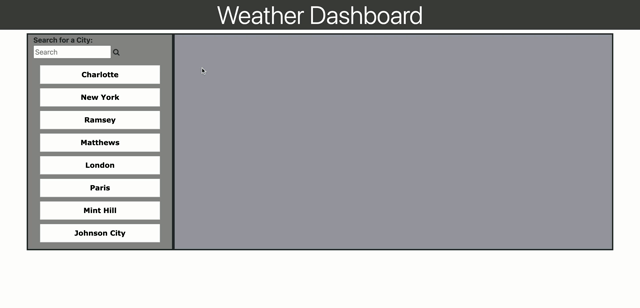

# Weather.Dashboard

## Table of Contents
1. [Webpage Links](##Webpage-Links)
2. [Webpage Details](##Webpage-Details)
3. [Demo Video](##Demo-Video)
4. [Acceptance Criteria](##Acceptance-Criteria)

## Webpage Links
Deployed Link: https://juliakiser.github.io/Weather.Dashboard/

Github Repo Link: https://github.com/JuliaKiser/Weather.Dashboard 


## Webpage Details
Explore various cities from the USA or around the world and download the current and future forecast for each location. This is an easy to use application. Displaying a search-input field for you to type in your desired search, press the magnifying glass to submit, and va-voom there you have it!

## Demo Video



## Acceptance Criteria

```
GIVEN a weather dashboard with form inputs
WHEN I search for a city
THEN I am presented with current and future conditions for that city and that city is added to the search history
WHEN I view current weather conditions for that city
THEN I am presented with the city name, the date, an icon representation of weather conditions, the temperature, the humidity, the wind speed, and the UV index
WHEN I view the UV index
THEN I am presented with a color that indicates whether the conditions are favorable, moderate, or severe
WHEN I view future weather conditions for that city
THEN I am presented with a 5-day forecast that displays the date, an icon representation of weather conditions, the temperature, and the humidity
WHEN I click on a city in the search history
THEN I am again presented with current and future conditions for that city
```

***
***

[Back to Top](##Table-of-Contents)

```
